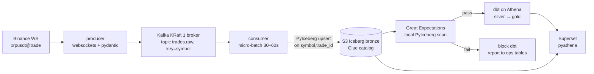

# Architecture

```mermaid
flowchart LR
    BIN[Binance WS<br/>xrpusdt@trade] --> PROD[producer<br/>websockets + pydantic]
    PROD --> KAFKA[Kafka KRaft 1 broker<br/>topic trades.raw, key=symbol]
    KAFKA --> CONS[consumer<br/>micro-batch 30–60s]
    CONS -->|PyIceberg upsert<br/>on symbol,trade_id| S3[(S3 Iceberg bronze<br/>Glue catalog)]
    S3 --> GX[Great Expectations<br/>local PyIceberg scan]
    GX -->|pass| DBT[dbt on Athena<br/>silver → gold]
    GX -->|fail| BLOCK[block dbt<br/>report to ops tables]
    DBT --> SUP[Superset<br/>pyathena]
    S3 --> SUP
```

Details per component live in `plan.md` §3 until each phase lands; this file becomes the narrated version in Phase 4 (data flow, delivery semantics, failure modes).
